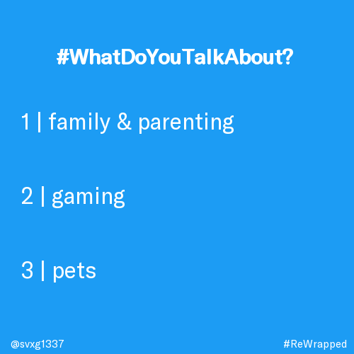
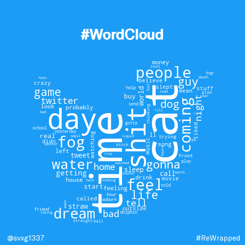
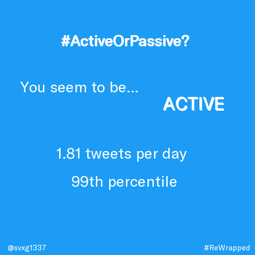
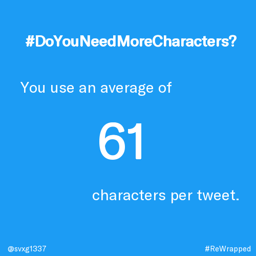

# twitter_rewrapped

Welcome to the "Twitter ReWrapped" repository! This project is designed to analyze a user's tweets and generate analytical images that summarize their activity on the social media platform. The images, which feature the user's handle, are then posted to the @Re_Wrapped Twitter account (*account currently suspended due to hacking incident*) for all to see.

The resulting images showcase various metrics such as:

#### #WhatDoYouTalkAbout? 
This feature allows users to see which topics (29 different possible topics) their tweets tend to focus on most frequently. This can be helpful for understanding what interests or passions the user has. In order to generate this image, we employed the use of a tensorflow model, specifically a multilayer perceptron (MLP), to analyze user tweets and classify them into various categories. To train and validate the model, we gathered a dataset of over 50,000 tweets from Reddit, using web scraping techniques. The resulting model was then applied to the user's tweet history, allowing us to visualize their tweet content and categorize it accordingly.

#### #WordCloud 
This visual representation shows the words that the user employs most frequently in their tweets, with larger words indicating more frequent usage. This can be a fun way to see what words or phrases define the user's communication style on the platform.

#### #ActiveOrPassive? 
This metric allows users to see how active they are on Twitter, with higher numbers indicating a more frequent posting schedule. This can be useful for understanding the user's level of engagement with the platform, and can also give insight into how much time they spend on social media.

#### #DoYouNeedMoreCharacters? 
This metric shows the length of the user's tweets on average, with higher numbers indicating longer tweets and lower numbers indicating shorter ones. This can be useful for understanding the user's communication style and how much they tend to share in a single tweet.

# 
Overall, "Twitter ReWrapped" is a great tool for anyone looking to get a deeper understanding of their Twitter activity and for those who just want to show off their social media prowess to their followers. The project is no longer active due to a lack of available credits on our Amazon Web Services account.

